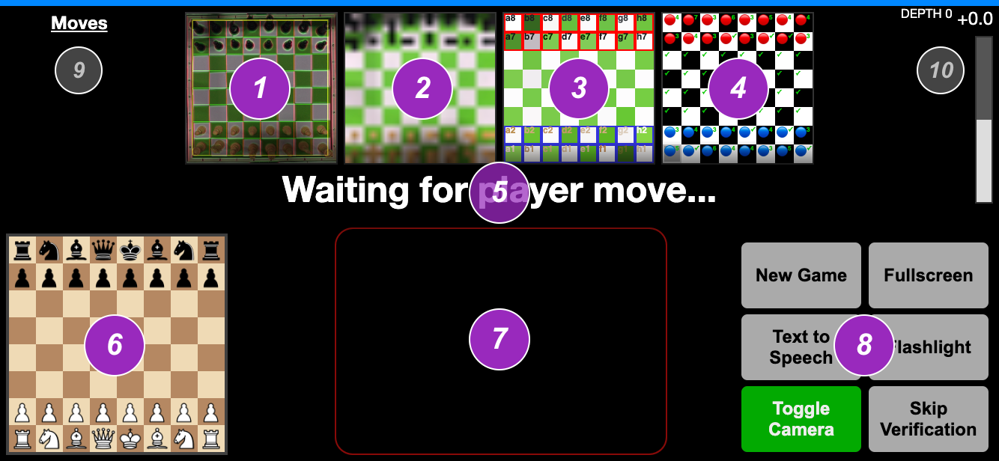

# ev3-chess-bot

Chess Bot Client Webapp to interface intepreted camera and Stockfish results with EV3.

Message-passing done via flashing the screen and using an NXT light sensor to recognise the data.

**JUMP TO:**
- [Setup, Installation and Usage](#setup-installation-and-usage)
- [Technical Implementation Details](docs/TECHNICAL.md)
- [Resolving Common Issues](docs/FIXING.md)

---

## Setup, Installation and Usage

### (1/2) Chess Engine and Message Passing

Instantly available at: [https://wernjie.github.io/ev3-chess-bot/engine/](https://wernjie.github.io/ev3-chess-bot/engine/)

**Setup:**
1. Run the webapp on a phone in landscape mode.
2. Initiate full screen mode if possible.
3. Ensure screen is at ***full brightness*** for best detection performance by the *chess_reader* EV3 later.
4. Enable the camera (tap "Enable Camera" and "Toggle Camera" until your desired back camera).
5. Mount it with the camera pointing to a white-green chessboard.
6. Ensure the camera sees the entire chessboard in parallel, and is not rotated.
7. Automatic cropping, calibration and normalisation of the camera footage will take over.
8. Continue setting up the EV3 (see part 2/2).

While the app detects chess pieces best with uniform lighting, the app can automatically calibrate against shadows that span at least 2 tiles horizontally, so not to worry about that.

**Understanding the UI:**

1. Camera View (with Auto-Crop Region Overlay).
2. Auto-Cropped Camera Output.
3. Normalised Detection Colours.
4. Camera Output Interpretation Preview.\*
5. Primary Status Message
6. Current Chessboard Layout
7. Light Transmission Region
8. Action Buttons
9. Current Moves List
10. Stockfish Evaluation Bar

\*Understanding the interpretations from camera footage:

| Indicator | Interpretation |
| --- | --- |
| 🔴 Red circle | Black chess piece (Black piece detected) |
| 🔵 Blue circle | White chess piece (Beige piece detected) |
| ⬛️ Dark background | Dark chess tile (Green tile detected) |
| ⬜️ Light background | Light chess tile (White tile detected) |
| ℹ️ Gray background | Chess tile (but detected mix of Green and White) |
| 🟧 Orange background | No tile detected |
| Orange background w/ H | Human hand covers tile completely |
| Orange outline | Current interpretation is uncertain |

 

### (2/2) EV3 controller network

Use the legacy [EV3 Lab software](https://education.lego.com/en-us/downloads/retiredproducts/mindstorms-ev3-lab/software) to open the EV3-G code and install it on three separate EV3 bots.

All movements are on repeated LEGO Technic 1x4 geared racks (3743) with 36 tooth double bevel gears (32498).

The default names for the three 'robots' are listed below and should be self-explanatory.

---
#### chess_x_axis

**Setup:**

Run program `x-axis` and wait for calibration confirmation beep. Should rest slightly before column A, with its claw up, ready to play.

<b>Motor Wiring Setup & Details (click to expand)</b>

<ul>
<li>Movement using *Large Motor B*. Runs in reverse direction (negative power drives movement from column A to column H), offset -80° rotation away from chessboard column A (outside of the board). </li>
<li>Pickup mechanism on *Large Motor A*. Range of motion approx slightly under 90°. Positive rotation to move mechanism down.</li>
<li>Claw mechanism on *Medium Motor D*. Jammable to close and open positions at 100% power in under 0.2 seconds. Positive rotation for closing.</li>
</ul>

Range of motion available from ***80° motor rotation before column A*** (jammed completely at full power) to ***column H***.

---
#### chess_y_axis

**Setup:**

Run program `y-axis` and wait for calibration confirmation beep. Should rest slightly past "row 9", ready to play as black.

<b>Motor Wiring Setup & Details (click to expand)</b>

<ul>
<li>Movement *Medium Motor C* for left side (next to chessboard column A; clockwise goes from rows 8-1)</li>
<li>Movement *Medium Motor B* for right side (next to chessboard column H; anticlockwise goes from rows 8-1)</li>
</ul>

Range of motion available from ***row 1*** to ***95° motor rotation past "row 9"*** (i.e. one imaginary row out of chess board, jammed completely).

---
#### chess_reader

**Setup:**

1. Run program `phone-reader` and ensure successful connection to the two other EV3s.

2. Ensure NXT light sensor is connected at port 3 and is secured, mounted and pointed towards the bottom region of the phone screen (outlined in red on the webapp).

3. Press Center button for first-time screen black level calibration. This measures the minimum black level of the screen (compensating for LCD backlights).

4. Make sure the EV3 screen displays "READY" and the phone screen displays "Waiting for player move" before you start the chess game.

**Shortcuts:**

- Press Center button to calibrate black levels at any time.
- Press Left button to forcibly terminate all pending requests and request movement to top left (1,0) position, then terminate `phone-reader`. Useful in event of corrupted transmission. If this does not work, you'll need to manually terminate all robot programs.
- Press Right button to send an arbitrary request to perform move b7g3 or g7b3 to test movement accuracy. Warning: Only initiate when idle or may cause transmission corruption.

<b>Motor Wiring Setup & Details (click to expand)</b>

<ul>
<li> *NXT Light Sensor* at port 3. Mount in less than one piece distance above the screen. Ensure **screen is at full brightness**. </li>
</ul>

This asynchronously reads screen flashes from phone and interprets as movement.

---

## Technical Implementation Details

Refer to [TECHNICAL.md](docs/TECHNICAL.md).

## Resolving Common Issues

Refer to [FIXING.md](docs/FIXING.md).
